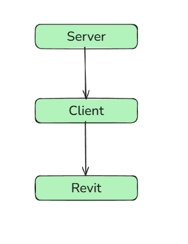

Revit MCP Blog
=======
[BLOG_ZH](README_ZH.md) | [BLOG_EN](README.md)

---

Currently, the internet is flooded with various AI-related information. As recent development work involves AI technology, this article introduces the integration method between MCP and Revit to achieve the "one-click modeling" feature in public accounts.

This is just one of the possible implementation approaches, and other technical paths exist. However, this method allows for rapid deployment, helping teams quickly explore relevant application directions.

## Function Call
Before discussing MCP, it's essential to introduce **Function Calling**—a capability provided by LLM APIs. By defining `Function Call` specifications during interactions with the LLM, the model can autonomously select and execute the appropriate functions when needed.

[**Picture From：ailydoseofds **](https://developer.aliyun.com/article/1665090)
Taking **DeepSeek** as an example, its API documentation provides a clear guide on how to use **Function Calling**.

``` python
tools = [  
	{  
		"type": "function",  
		"function": {  
			"name": "get_weather",  
			"description": "Get weather of an location, the user shoud supply a location first",  
			"parameters": {  
				"type": "object",  
				"properties": {  
					"location": {  
						"type": "string",  
						"description": "The city and state, e.g. San Francisco, CA",  
					}  
			},  
			"required": ["location"]  
			},  
		}  
	},  
]
```
The underlying logic is that the LLM, when generating a response, will:

1. **Select the appropriate function** based on the context and generate compliant parameters.
2. **Execute** the function.
3. **Retrieve the result** and return it.
4. **Summarize the output** and deliver it to the client interface.

## MCP
### Introduce MCP 
**MCP (Model Context Protocol)** is an extension protocol of **Function Calling** technology. Its core value lies in **standardized modeling**, enabling developers to write a single Function Call definition that seamlessly adapts to multiple mainstream LLMs (e.g., DeepSeek, ChatGPT, etc.).

### How It Works:

1. **Unified Modeling**: Generates platform-agnostic invocation instructions compliant with cross-model specifications.
2. **Autonomous Execution**: The LLM dynamically selects the optimal execution path based on the standardized context.
3. **Cross-Model Compatibility**: Ensures consistent function calling behavior across different model providers.

 [**图片来源：ailydoseofds ** ](https://developer.aliyun.com/article/1665090)
### **MCP Framework**

The MCP framework consists of three core components:
1. **Host**
2. **Client** 
3. **Server** 
#### MCP Server 
MCP supports multiple communication methods to adapt to different application scenarios:
#### **1. Stdio (Standard Input/Output)**
- **Usage**: Commonly used for local data exchange via stdin/stdout.
- **Application**: Suitable for **Revit integration**—either use the default Stdio mode or implement a custom `IMcpTransport` for Revit-specific optimizations.
#### **2. Stream (HTTP-based Streaming)**
- **Protocol**: Fully compliant with standard **HTTP** for web-based interactions.
- **Advantage**: Ideal for real-time data streaming in web applications.
#### **3. SSE (Server-Sent Events)**

- **Mechanism**: Uses **HTTP long-polling** for persistent remote communication.
- **Use Case**: Efficient for scenarios requiring **server-to-client push updates** (e.g., live logs, progress tracking).

### MCP Process

 [**Picture From：ailydoseofds** ](https://developer.aliyun.com/article/1665090)
## Prompt 
### Introduction

In API-based MCP implementations, prompt engineering plays a decisive role, with its core value reflected in:

#### **1. Tool Selection Accuracy**

By dynamically adjusting conversational bias, it guides the LLM to select the most suitable tool in each interaction.

#### **2. Probability Distribution Control**

Uses constrained prompts to adjust the model's output probability distribution, making responses better align with target requirements.

#### **3. Prompt Engineering in API Context**

In MCP API calls, prompt engineering is critical—it directly impacts the accuracy of tool (Tools) selection. Each round of dialogue influences the model's decision-making tendency, and optimized prompts can guide the model to produce more expected results.

#### **4. Example: BIM Expert System**

- **Role Setting**: Defined as **"BIM Expert"** in `system` to ensure precise selection of design tools.
- **Additional Constraints**: For smoother interaction, further prompt optimization is needed, such as limiting tool scope or adjusting matching logic.

#### **5. Tool Matching Mechanism**

The LLM selects based on **Tool Description** and dynamically matches the most suitable tool through response content, ensuring precise and efficient interactions.

## .NET MCP Framework

Since Revit has extensive support for C#, we chose the .NET MCP framework: [modelcontextprotocol](https://github.com/modelcontextprotocol).

### .NET MCP Framework Overview

This is an open-source MCP framework supporting .NET, where the source code can be directly downloaded from GitHub for learning. The framework uses traditional I/O transmission and outputs via the console.  
As users, we only need to understand the following interfaces:
1. Tools
	- Use `[McpServerToolType]` to define the Tools class
	- Use `[McpServerTool]` to define specific methods
	- The following method can invoke the LLM to output a string
		```csharp
		[McpServerToolType]
		public  class RevitTool
		{
		    [McpServerTool(Name = "RevitTool"), Description("Revit Execute Command , Also can execute some string output")]
		    public string RevitCommandTool(string command)
		    {
		        Console.WriteLine(command);
		        //MessageBox.Show($"Revit Command: {command}", "Revit Tool Command", MessageBoxButtons.OK, MessageBoxIcon.Information);
		        return command;s
		    }
		```
2. Server
	
	- The framework supports both **dependency injection** and **declarative approaches**:
	- **Inject and publish** `Tools`
	- Simply put, it allows all your `Tools` to be published **without manual integration into `Function Call`**. The LLM automatically reads their descriptions and invokes them as needed.
		```csharp
		var builder = Host.CreateApplicationBuilder();
		builder.Services.AddMcpServer()
		    .WithStdioServerTransport()
		    .WithTools<RevitTool>();
		
		await builder.Build().RunAsync();
		```
3. Client
	-   Use Local Path To Execute Service
 ```csharp
		 await using var mcpClient = await McpClientFactory.CreateAsync(new StdioClientTransport(new StdioClientTransportOptions()
		{
		    Name = "Demo Server",
		    Command = "powershell",
		    Arguments = ["D:\\NET.Mcp.Server.exe"]
		}));
 ```

-  Implement LLM dialogue and pass the Tools data from the Server to the LLM. Here, I am using DeepSeek's API to achieve LLM dialogue by calling the API.
```csharp
var openAiOptions = new OpenAIClientOptions();
openAiOptions.Endpoint = new Uri("https://api.deepseek.com/v1/");

var chatClient = new ChatClient("deepseek-chat", new ApiKeyCredential("******"), openAiOptions);

var client = new ChatClientBuilder(chatClient.AsIChatClient()).UseFunctionInvocation().Build();

var prompts = new List<Microsoft.Extensions.AI.ChatMessage>
{
    new ChatMessage(ChatRole.System, """you are a professional enginer in BIM , so you can select the greate tool to user , and generation a standard input style And Arguments to tools"""),
    new ChatMessage(ChatRole.User, input)
};

var tools = await mcpClient.ListToolsAsync();

var chatOptions = new ChatOptions()
{
    Tools = [.. tools]
};
```
- Get Values
```csharp
var res = await client.GetResponseAsync(prompts, chatOptions);

var message = res.Messages[1].Contents[0];
var value = ((Microsoft.Extensions.AI.FunctionResultContent)message).Result;
var convert = JsonConvert.DeserializeObject(value.ToString());

// 反序列化
ResponseData data = JsonConvert.DeserializeObject<ResponseData>(value.ToString());

// 访问数据
foreach (var item in data.Content)
{
    //Console.WriteLine($"Type: {item.Type}, Text: {item.Text}");
    var d = item.Text;
    
    Console.WriteLine(d);
}
```

## Bind Revit
### Preview
[Revit & MCP](https://youtu.be/dyCuBKWDc3Q)
### Introduce
When using MCP or FunctionCall in Revit, the code examples demonstrate that the LLM can automatically select and execute the appropriate tools based on input, thereby enabling AI-driven modeling or review operations.  
Therefore, I believe this approach is better suited for teams that already have plugin development capabilities or established design workflows. For teams with limited development resources, using MCP may be less time-efficient than direct manual operations or developing plugins with fixed logic.
### Bind
1.The previous explanation mentioned that stdio uses standard input/output, but this conflicts with Revit's inherent mechanism. Directly waking up the server within Revit to fetch data would cause Revit to freeze, as the entire process would be blocked. Therefore, in my case, I resolved this by using a separate process to launch a console, thereby obtaining console input before connecting to Revit.

- The issue likely lies in the use of `TextReader/TextWriter` in the `Transport` component. In the source code, this is located at:  
    `ModelContextProtocol.Protocol.Transport\StreamClientSessionTransport`
    
2.  The second approach involves connecting to the MCP service via **Idling events**, where **WCF (Windows Communication Foundation)** can also enable automated MCP execution. Those interested can implement this themselves.
	**However**, the **Idling event's thread must be properly constrained**—otherwise, continuous API feedback polling could still cause Revit to freeze.
> [https://thebuildingcoder.typepad.com/blog/2012/11/drive-revit-through-a-wcf-service.html](https://thebuildingcoder.typepad.com/blog/2012/11/drive-revit-through-a-wcf-service.html)
3. The third approach involves **directly modifying the source code** to implement a custom **`TransportBase` or `ITransport`**, specifically tailored for client-side request handling.
4. The last approach is a more straightforward method, which I find quite effective. Since non-commercial clients typically interact with a single LLM provider, such as `ChatGPT` or `DeepSeek`, using `Function Call` directly is also viable. This avoids thread blocking and allows for direct invocation.

### Revit

If the **Server** and **Client** are already implemented, the key change needed for **Revit** is to **add new input parameter retrieval**. Since AI inputs and outputs are entirely text-based, if we want the LLM to drive automatic execution, we must **unify the parameter input interface** for methods.

In this project, I used **JSON** as the conversion format. By transforming parameters into JSON, we enable method execution while ensuring **minimal future modifications** to the methods.

#### Preparations

##### Standard Output Format

1. As mentioned earlier, JSON is used for input and output. Therefore, modifications were made in the tools to ensure that both the desired method name and parameters are output together. Taking wall creation as an example: the start and end points of the positioning line are obtained. If the parameters are more complex, the description must clearly mark the content to prevent incorrect data or parameters.
Description：
```general
"Generation A Window In A Selection Wall , Define Window Size : 1500 x 1200 d, Need To Calculate The Window-Top Is Small Then Wall-Height , This Command Need Input Args : ElementId , LocationX , LocationY ,LocationZ")
```
```
Tool：
```csharp
[McpServerTool(Name = "CreateWall"), Description("Generation Paramaters That Can Create Wall in Revit")]
public string RevitCreateWallTool(string command, double x, double y, double z, double x1, double y2)
{
    return $@"
            {{
                ""command"": ""CreateWall"",
                ""arguments"": {{
                    ""start"": [{x}, {y}, {z}],
                    ""end"": [{x1}, {y2}, {z}]
                }}
            }}"; 
}
```
2. In Revit, create a data structure to receive data and convert it into usable data.
```csharp
 public class CreateWallData
 {
     [JsonProperty(PropertyName = "command")]
     public string Command { get; set; } = string.Empty;
     [JsonProperty(PropertyName = "arguments")]
     public object Args { get; set; }
 }
```
3. Create an interface to standardize our plugin commands. Here I've simply created one that expects all entry points to accept JSON strings, with data being parsed separately within the methods.
```csharp
public interface IRevitCommand
{
    void Execute(string jsonArgs);
}
```
3. For the execution function, implement the interface to convert the original coordinate points into JSON strings.
``` csharp
 /// <summary>
 /// This A MCP Test
 /// </summary>
 /// <param name="x"></param>
 /// <param name="y"></param>
 /// <param name="x1"></param>
 /// <param name="y1"></param>
 /// <param name="z"></param>
 private class CreateWall : IRevitCommand
 {
     public void Execute(string jsonArgs)
     {
         var args = JsonConvert.DeserializeObject<CreateWallArguments>(jsonArgs);
         var x = args.Start[0];
         var y = args.Start[1];
         var z = args.Start[2];
         var x1 = args.End[0];
         var y1 = args.End[1];
         var z1 = args.End[2];

         TransactionUtils.Execute(RevitCommandData.Document, (nx) =>
         {
             var start = new XYZ(x/304.8, y/304.8, z);
             var end = new XYZ(x1/304.8, y1/304.8, z1);
             var line = Line.CreateBound(start, end);
             Wall.Create(RevitCommandData.Document, line ,RevitCommandData.ActiveView.GenLevel.Id, false);
         }, "CreateWall");

     }
 }
```
5. Using reflection, we can locate the methods implementing the `IRevitCommand` interface and create new methods for execution.
```csharp
// 1. Load DLL
Assembly assembly = typeof(Command).Assembly;
// 2. Use Interface To Find Class
Type commandType = assembly.GetTypes()
    .FirstOrDefault(t => t.Name == methodName);

if (commandType == null)
    throw new Exception($"Cant Find {methodName} ");

var eCommand = (IRevitCommand)Activator.CreateInstance(commandType);
eCommand.Execute(JsonConvert.SerializeObject(jsonConvertData.Args));
```
6.  If interaction with Revit is needed, simply adding parameters to the `arguments` will enable Revit-LLM interaction. Compared to the above, this involves adding code to select a wall and pass its ID and data to the LLM as a reference for inserting doors and windows.
```csharp
var args = string.Empty;
if (selection.IntegerValue == -1)
{
    args = string.Empty;
}
else
{

    var ele = RevitCommandData.Document.GetElement(selection) as Wall;

    var wallLocation = ele.Location as LocationCurve;
    var wallString = ConvertToString(wallLocation.Curve);
    args = $"WallId:{selection} , WallData: {wallString}";
}
```
7.  Use `process` Execute `client` and Get Input / OutPut
```csharp
 var process = new Process
 {
     StartInfo = new ProcessStartInfo
     {
         FileName = @"D:\NET.Mcp.Client.exe",          
         Arguments = this.TextBox.Text + $"Selected ElementData ：{args}",       
         UseShellExecute = false,     // false 
         CreateNoWindow = true,       // hidden console window
         RedirectStandardOutput = true, 
         RedirectStandardError = true 
     }
 };

 process.Start();

 // standout output
 string output = process.StandardOutput.ReadToEnd();
 string errors = process.StandardError.ReadToEnd(); 

 process.WaitForExit(); // wait thread
 process.Close(); // close thread
```

#### Actual Execution

##### Execution Content

In this project, I will invoke the LLM to create a wall, then after selecting the wall, continue to call the LLM to insert a window at any position, achieving multi-turn dialogue and bidirectional interaction between Revit and the LLM.

##### MCP-Server
```csharp
using System.ComponentModel;
using System.Windows.Forms;
using Microsoft.Extensions.DependencyInjection;
using Microsoft.Extensions.Hosting;
using ModelContextProtocol.Server;

var builder = Host.CreateApplicationBuilder();
builder.Services.AddMcpServer()
    .WithStdioServerTransport()
    .WithTools<RevitTool>();

await builder.Build().RunAsync();


[McpServerToolType]
public  class RevitTool
{
    [McpServerTool(Name = "RevitTool"), Description("Revit Execute Command , Also can execute some string output")]
    public string RevitCommandTool(string command)
    {
        Console.WriteLine(command);
        //MessageBox.Show($"Revit Command: {command}", "Revit Tool Command", MessageBoxButtons.OK, MessageBoxIcon.Information);
        return command;
    }


    [McpServerTool(Name = "CreateWall"), Description("Generation Paramaters That Can Create Wall in Revit")]
    public string RevitCreateWallTool(string command, double x, double y, double z, double x1, double y2)
    {
        return $@"
                {{
                    ""command"": ""CreateWall"",
                    ""arguments"": {{
                        ""start"": [{x}, {y}, {z}],
                        ""end"": [{x1}, {y2}, {z}]
                    }}
                }}"; 
    }


    [McpServerTool(Name = "ChangeWallWeight"), Description("Change All Wall's Weight")]
    public string ChangeWallWeightTool(string command, double weight)
    {
        return $@"
                {{
                    ""command"": ""ChangeWallWeight"",
                    ""arguments"": {{
                        ""weight"": {weight}
                    }}
                }}";
    }


    [McpServerTool(Name = "InsertWindowInWall"), Description("Generation A Window In A Selection Wall , Define Window Size : 1500 x 1200 d, Need To Calculate The Window-Top Is Small Then Wall-Height , This Command Need Input Args : ElementId , LocationX , LocationY ,LocationZ")]
    public string InsertWindowInWallTool(string command , int eId , double x , double y , double z)
    {
        return $@"
                {{
                    ""command"": ""InsertWindowInWall"",
                    ""arguments"": {{
                        ""eId"" : {eId} ,
                        ""location"": [{x},{y},{z}]
                    }}
                }}"; 
    }
}
```

##### MCP-Client
```csharp
using Microsoft.Extensions.AI;
using ModelContextProtocol.Client;
using ModelContextProtocol.Protocol;
using OpenAI.Chat;
using OpenAI;
using System.ClientModel;
using System.Collections.ObjectModel;
using System.Diagnostics;
using System.Net;
using System.Text;
using System.Text.Json;
using System.Text.Json.Serialization;
using ChatMessage = Microsoft.Extensions.AI.ChatMessage;
using Newtonsoft.Json;
using System.Windows.Forms;

var input = string.Join("",args);

Debug.Print(input);
//var input = "Insert a window on an existing wall with ID 333160, coordinates from (0,0,0) to (10000,0,0), height 3000 (unit: mm). Window position can be determined by you";  
//var input = "Create a wall with coordinates (0,0,0)->(10000,0,0), unit: mm";  
//var input =  
// "Insert a window on the selected wall with height 3000 (unit: mm). Window position can be determined by you. Selected element data: WallId:333160, WallData: Curve Data is: Start = X = 0, Y = 0, Z = 0, End = X = 10000, Y = 0, Z = 0";  
//"Insert a window on the selected wall with height 3000 (unit: mm). Window position can be determined by you. Curve Data is: Start = X = 0, Y = 0, Z = 0, End = X = 10000, Y = 0, Z = 0";
await using var mcpClient = await McpClientFactory.CreateAsync(new StdioClientTransport(new StdioClientTransportOptions()
{
    Name = "Demo Server",
    Command = "powershell",
    Arguments = ["D:\\NET.Mcp.Server.exe"]
}));

var openAiOptions = new OpenAIClientOptions();
openAiOptions.Endpoint = new Uri("https://api.deepseek.com/v1/");

var chatClient = new ChatClient("deepseek-chat", new ApiKeyCredential("sk-0000000000000"), openAiOptions);

var client = new ChatClientBuilder(chatClient.AsIChatClient()).UseFunctionInvocation().Build();

var prompts = new List<Microsoft.Extensions.AI.ChatMessage>
{
    new ChatMessage(ChatRole.System, """you are a professional enginer in BIM , so you can select the greate tool to user , and generation a standard input style And Arguments to tools"""),
    new ChatMessage(ChatRole.User, input)
};


var tools = await mcpClient.ListToolsAsync();

var chatOptions = new ChatOptions()
{
    Tools = [.. tools]
};
var res = await client.GetResponseAsync(prompts, chatOptions);

var message = res.Messages[1].Contents[0];
var value = ((Microsoft.Extensions.AI.FunctionResultContent)message).Result;
var convert = JsonConvert.DeserializeObject(value.ToString());

// DeserializeObject
ResponseData data = JsonConvert.DeserializeObject<ResponseData>(value.ToString());

foreach (var item in data.Content)
{
    //Console.WriteLine($"Type: {item.Type}, Text: {item.Text}");
    var d = item.Text;
    
    Console.WriteLine(d);
}

public class CreateWallData
{
    [JsonProperty(PropertyName = "command")]
    public string Command { get; set; } = string.Empty;
    [JsonProperty(PropertyName = "arguments")]
    public CreateWallArguments Args { get; set; }
}

public class CreateWallArguments
{
    [JsonProperty(PropertyName = "start")]
    public double[] Start { get; set; }
    [JsonProperty(PropertyName = "end")]
    public double[] End { get; set; }
}

public class ContentItem
{
    public string Type { get; set; }
    public string Text { get; set; }
}

public class ResponseData
{
    public List<ContentItem> Content { get; set; }
    public bool IsError { get; set; }
}

```

##### Revit

```csharp

                    var selections = RevitCommandData.UiDocument.Selection.GetElementIds();
                    var selection = ElementId.InvalidElementId;
                    if (selections.Any())
                    {
                        selection = selections.First();
                    }
                    var args = string.Empty;
                    if (selection.IntegerValue == -1)
                    {
                        args = string.Empty;
                    }
                    else
                    {
                        var ele = RevitCommandData.Document.GetElement(selection) as Wall;
                        var wallLocation = ele.Location as LocationCurve;
                        var wallString = ConvertToString(wallLocation.Curve);
                        args = $"WallId:{selection} , WallData: {wallString}";
                    }

                    var process = new Process
                    {
                        StartInfo = new ProcessStartInfo
                        {
                            FileName = @"D:\NET.Mcp.Client.exe",          
                            Arguments = this.TextBox.Text + $"选中构件的数据为 ：{args}",       
                            UseShellExecute = false,     
                            CreateNoWindow = true,     
                            RedirectStandardOutput = true, 
                            RedirectStandardError = true  
                        }
                    };

                    process.Start();

                   
                    string output = process.StandardOutput.ReadToEnd();
                    string errors = process.StandardError.ReadToEnd(); 

                    process.WaitForExit(); 
                    process.Close();

                    if (string.IsNullOrEmpty(errors))
                    {
                        var jsonConvertData = JsonConvert.DeserializeObject<CreateWallData>(output);
                        var methodName = jsonConvertData.Command;
                        
                        Assembly assembly = typeof(Command).Assembly;
                       
                        Type commandType = assembly.GetTypes()
                            .FirstOrDefault(t => t.Name == methodName);

                        if (commandType == null)
                            throw new Exception($"未找到 {methodName} 的实现类");

                        var eCommand = (IRevitCommand)Activator.CreateInstance(commandType);
                        eCommand.Execute(JsonConvert.SerializeObject(jsonConvertData.Args));

                    }
```
### Summary

From practical cases, it is evident that the application path of AI in the construction industry has become relatively clear, far from the exaggerated and mystified portrayals in certain articles or videos. As users, we should focus more on AI's efficiency-enhancing capabilities in specific scenarios, such as code compliance review, batch modeling, and drawing processing.

The purpose of this article is to help readers establish a fundamental understanding of AI technology through a simple case study. Currently, public accounts and online articles are flooded with mixed-quality content, which can easily lead to misconceptions. By demonstrating real-world examples, practitioners can more accurately assess the application scope and depth of AI, thereby effectively identifying and filtering out irrelevant or misleading information.
>>>>>>> 99d9dd8 (push)
